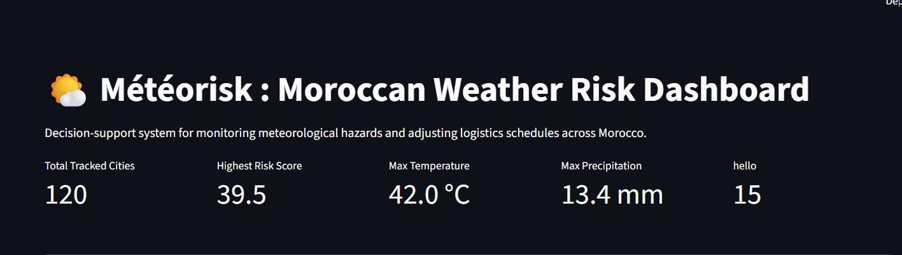
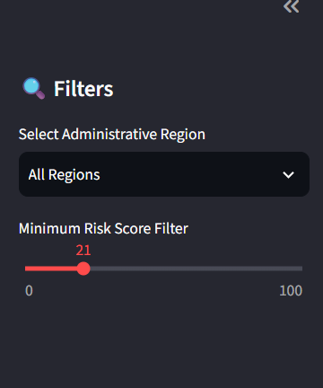
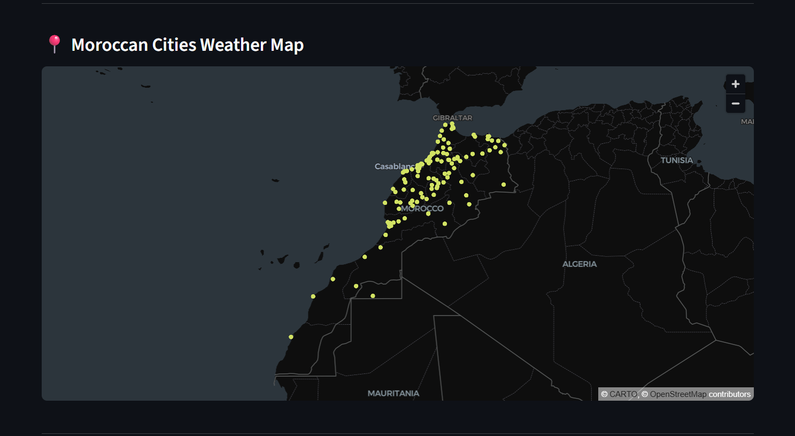
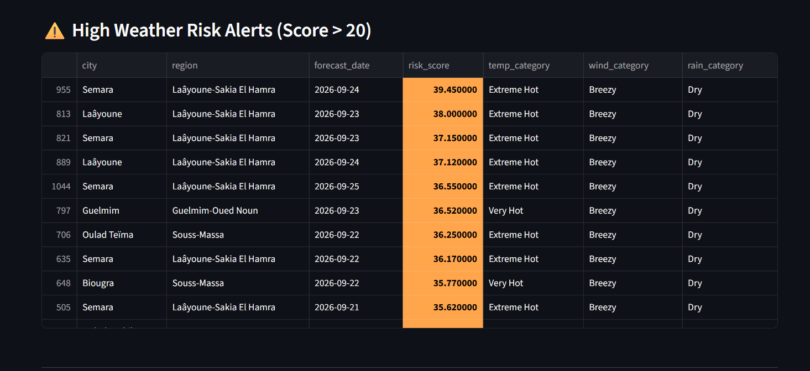
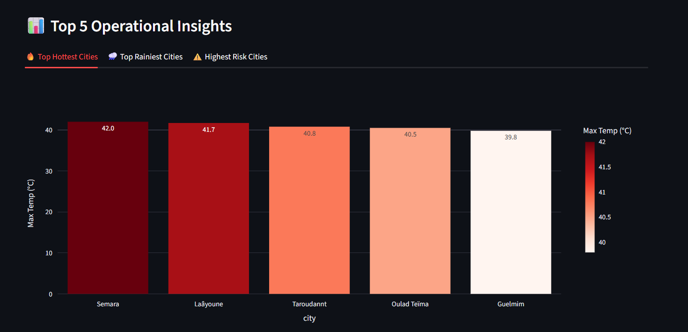
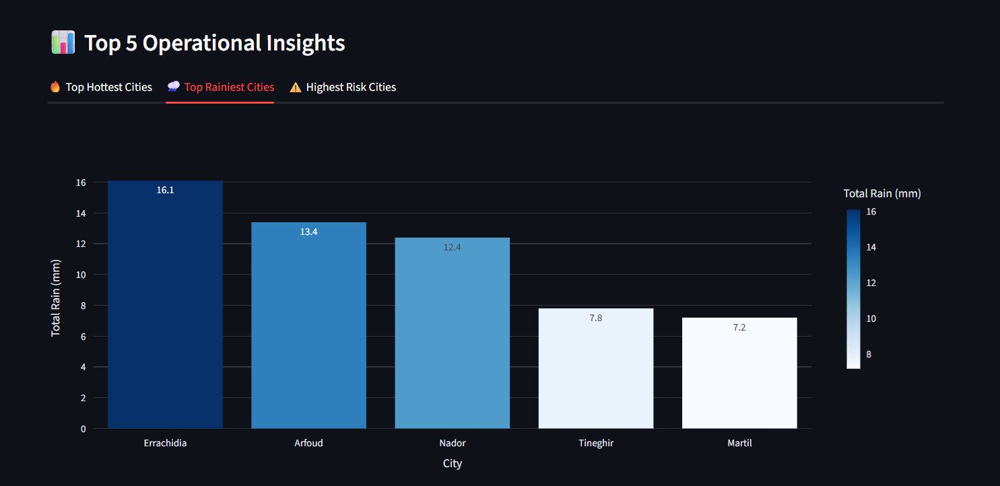
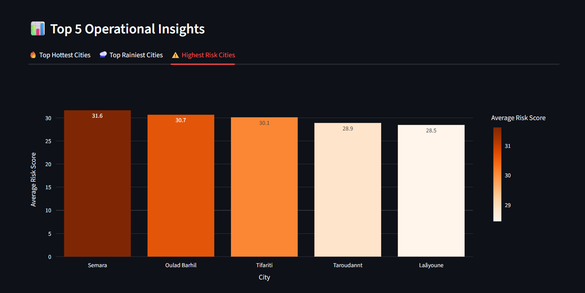
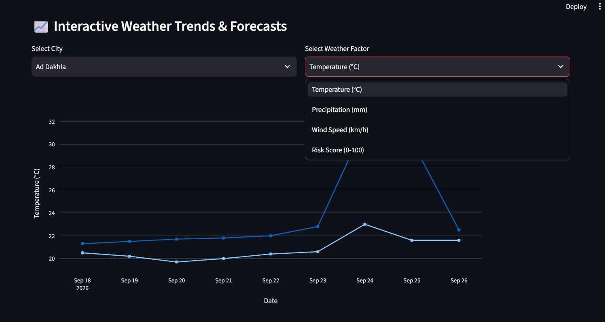
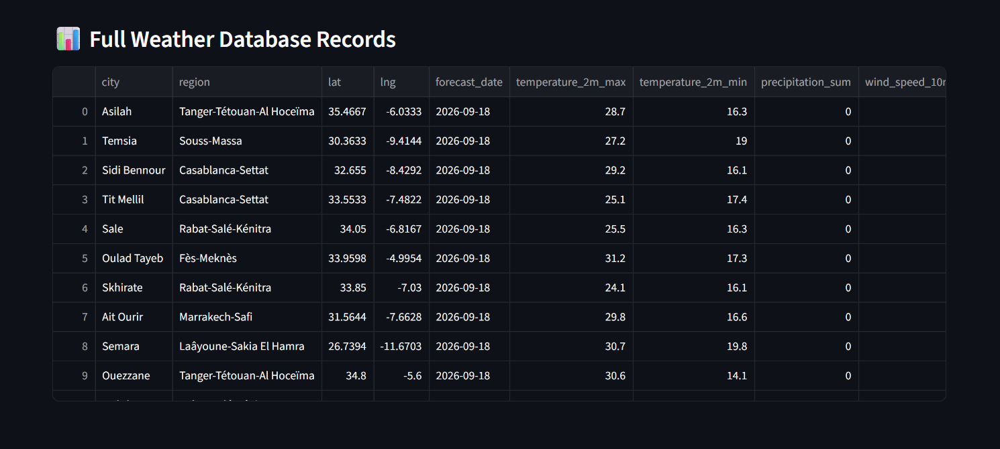

# 🌤️ Météorisk — End-to-End Weather Risk ETL Pipeline & Dashboard

## 📋 Project Overview
**Météorisk** is a decision-support data engineering system designed for a delivery logistics company operating across Moroccan cities. The system fetches multi-day weather forecasts, cleans and normalizes raw data, engineers categorical hazards and a composite **Weather Risk Score (0–100)**, loads the structured data into PostgreSQL, and presents interactive insights via a **Streamlit Dashboard** automated by **Apache Airflow** and **Docker**.

---

## 🏗️ Architecture (Medallion Pattern)

[Open-Meteo API & ma.csv]
           │
           ▼
    [Bronze Layer]  ──> Raw JSON payloads (Bronz/bronze_data.csv)
           │
           ▼
    [Silver Layer]  ──> Exploded, deduplicated, interpolated records (Silver/silver_data.csv)
           │
           ▼
     [Gold Layer]   ──> Feature engineering & Risk Score (Gold/gold_data.csv)
           │
           ▼
    [PostgreSQL]    ──> Relational DB (admin_region, city, weather_detail)
           │
   ┌───────┴──────────────┐
   │                      │
   ▼                      ▼
[SQL Analysis]     [Streamlit Dashboard]

## 🚀 Step-by-Step Breakdown

### Étape 1: Data Extraction (Bronze Layer)
* **Goal**: Fetch multi-day daily weather forecasts for Moroccan cities while preserving raw API responses.
* **Source Inputs**: `ma.csv` containing city names, administrative regions, latitudes, and longitudes.
* **API Target**: Open-Meteo Forecast API (`temperature_2m_max`, `temperature_2m_min`, `precipitation_sum`, `precipitation_probability_max`, `wind_speed_10m_max`, `wind_gusts_10m_max`, `weather_code`).
* **Resilience**: Implements `try/except` blocks and timeout configurations (`timeout=10`) so individual city failures do not crash the batch job.
* **Storage**: Output saved as `Bronz/bronze_data.csv`.

### Étape 2: Cleaning & Standardization (Silver Layer)
* **Goal**: Transform unnested daily JSON arrays into an atomic, relational 1-row-per-city-per-date grain.
* **Key Operations**:
  1. Parses daily string dictionaries using `ast.literal_eval` and flattens them via `pd.json_normalize`.
  2. Unnests list columns using `explode()`.
  3. Standardizes column names (`time` → `forecast_date`) and formats dates (`YYYY-MM-DD`).
  4. Imputes missing dates per city using forward fill (`ffill`) and time offsets.
  5. Interpolates missing numerical values per city using linear mean interpolation (`interpolate(method='linear')`) with boundary fill (`ffill().bfill()`).
  6. Removes duplicate records based on the business key `(city, forecast_date)`.
* **Storage**: Saved as `Silver/silver_data.csv`.

### Étape 3: Feature Engineering, Scoring & Database Load (Gold Layer)
* **Goal**: Compute operational hazard categories, derive the 0–100 Weather Risk Score, and load data into PostgreSQL.
* **Engineered Features**:
  * `temp_category`: Binned into 9 levels ('Extreme Freezing' to 'Extreme Hot').
  * `rain_category`: Binned into 5 levels ('Dry' to 'Extreme Rain').
  * `wind_category`: Binned into 5 levels ('Calm' to 'Severe Storm').
  * `risk_score`: Weighted composite score (37.5% Rain + 37.5% Wind + 25% Temp deviation).
* **Database Schema**:
  * `admin_region` (Parent dimension: `id`, `name`).
  * `city` (Child dimension: `id`, `name`, `lat`, `lng`, `admin_id`).
  * `weather_detail` (Fact table: foreign key `city_id`, `forecast_date`, metrics, categories, `risk_score`).
* **Deduplication / Upsert Strategy**: Clears existing records for matching `(city_id, forecast_date)` pairs prior to insertion to handle pipeline re-runs gracefully.

### Étape 4: Business SQL Analytics
* **Goal**: Query PostgreSQL to answer key operational questions:
  1. Top 5 hottest cities by max temperature.
  2. Top 5 rainiest cities by total rainfall.
  3. Top 5 highest risk cities by average risk score.
  4. Top 5 dates with maximum risk scores.
  5. Peak risk forecast date for each city.

### Étape 5: Interactive Decision-Support Dashboard
* **Goal**: Provide operational managers with a UI to monitor weather risks and adapt delivery schedules.
* **Components**:
  * **Top KPIs**: Total cities, highest risk score, max temp, max rain.
  * **Interactive Map**: Geographical plotting of Moroccan city locations.
  * **High-Risk Alerts**: Color-coded table highlighting instances where `risk_score > 20`.
  * **Top 5 Insights**: Visual Plotly bar charts answering Étape 4 questions.
  * **Interactive Trend Charts**: Plotly line chart with city/factor selectboxes, week vs. day toggles, Y-axis zooming, and unified hover tooltips.
  * **Sidebar Filters**: Filter entire dashboard by region and minimum risk score slider.

### Étape 6: Orchestration & Docker Infrastructure
* **Goal**: Automate execution schedules and containerize all services.
* **Airflow DAG (`meteorisk_etl_pipeline`)**:
  * Scheduled `@daily` with retry policies (`retries=2`, `retry_delay=5 min`).
  * Tasks: `extract_task` ➔ `transform_task` ➔ `load_task` using `@task` decorators.
* **Docker Compose Services**:
  * `postgres`: PostgreSQL database instance.
  * `airflow-webserver`: Airflow UI & Scheduler running in standalone mode.
  * `streamlit`: Streamlit dashboard web server.

---

## 🛠️ Complete Predefined & Custom Function Reference

### 1. Extraction Module (`extract.py`)
| Function | Parameters | Description |
| :--- | :--- | :--- |
| `extract()` | None | Reads `ma.csv`, queries Open-Meteo API for each city's forecast with error handling, attaches metadata, and exports raw data to `Bronz/bronze_data.csv`. |

---

### 2. Transformation Module (`transform.py`)
| Function | Parameters | Description |
| :--- | :--- | :--- |
| `transform()` | None | Reads Bronze data, un-nests JSON structures, explodes array columns into daily rows, imputes missing dates/metrics, deduplicates rows, and saves `Silver/silver_data.csv`. |
| `validate_data_quality(df)` | `df` (DataFrame) | Asserts data boundaries (temp between -20°C and 60°C, non-negative rain/wind, no null forecast dates). |

---

### 3. Feature Engineering & Load Module (`load.py`)
| Function | Parameters | Description |
| :--- | :--- | :--- |
| `get_temp_category(temp)` | `temp` (float) | Assigns one of 9 temperature categories ('Extreme Freezing' to 'Extreme Hot') based on temperature thresholds. |
| `get_rain_category(rain)` | `rain` (float) | Assigns one of 5 rainfall categories ('Dry' to 'Extreme Rain') based on daily mm thresholds. |
| `get_wind_category(wind)` | `wind` (float) | Assigns one of 5 wind categories ('Calm' to 'Severe Storm') based on km/h thresholds. |
| `calculate_risk_score(rain_mm, wind_kmh, temp_max, temp_min)` | `rain_mm`, `wind_kmh`, `temp_max`, `temp_min` | Calculates the composite 0–100 Weather Risk Score using weighted sub-scores (37.5% Rain, 37.5% Wind, 25% Temp deviation). |
| `transform_silver_to_gold(df)` | `df` (DataFrame) | Applies categorization functions and risk score calculation across the Silver DataFrame and outputs `Gold/gold_data.csv`. |
| `load_to_postgres(df_gold, db_url)` | `df_gold` (DataFrame), `db_url` (str) | Sets up SQLAlchemy ORM tables (`AdminRegion`, `City`, `WeatherDetail`), handles foreign key mapping, executes duplicate deletion, and bulk-inserts records into PostgreSQL. |

---

### 4. Dashboard Module (`app.py`)
| Function | Parameters | Description |
| :--- | :--- | :--- |
| `load_weather_data()` | None | Cached function (`ttl=300`) executing SQL JOINs across `weather_detail`, `city`, and `admin_region` to return a unified DataFrame. |
| `apply_risk_color(val)` | `val` (float) | Returns CSS string for background colors (>50 red, >20 orange, ≤20 green) to style risk table rows. |

---

### 5. Orchestration Module (`dags/weather_dag.py`)
| Function / Task | Parameters | Description |
| :--- | :--- | :--- |
| `extract_task()` | None | Airflow `@task` wrapper triggering `extract()`. |
| `transform_task()` | None | Airflow `@task` wrapper triggering `transform()`. |
| `load_task()` | None | Airflow `@task` wrapper reading `Silver/silver_data.csv`, running `transform_silver_to_gold()`, and invoking `load_to_postgres()`. |

---

## 🧮 Business Risk Score Justification

$$\text{Risk Score} = \left( 0.375 \times \text{Rain Risk} + 0.375 \times \text{Wind Risk} + 0.25 \times \text{Temp Risk} \right) \times 100$$

1. **Rain Sub-Score (37.5% Weight)**: Scaled linearly up to 50 mm/day. Rain poses immediate traction, hydroplaning, and package damage hazards during delivery handoffs.
2. **Wind Sub-Score (37.5% Weight)**: Scaled linearly up to 75 km/h (Beaufort Gale force). Wind destabilizes two-wheeler balance and creates lateral hazards.
3. **Temperature Sub-Score (25% Weight)**: Measures deviation from the 21.5°C human optimal comfort midpoint. Extreme heat (>40°C) or freezing (<0°C) induces driver fatigue and thermal stress.

## 📸 Dashboard Screenshots

### 1. Header & Key Performance Indicators (KPIs)

### 2. Sidebar Filters

### 3. Moroccan Cities Weather Map

### 4. High Weather Risk Alerts Table

### 5. Top 5 Operational Insights
* **Top Hottest Cities**
  
* **Top Rainiest Cities**
  
* **Highest Risk Cities**
  

### 6. Interactive Weather Trends & Forecasts

### 7. Full Database Records Table
